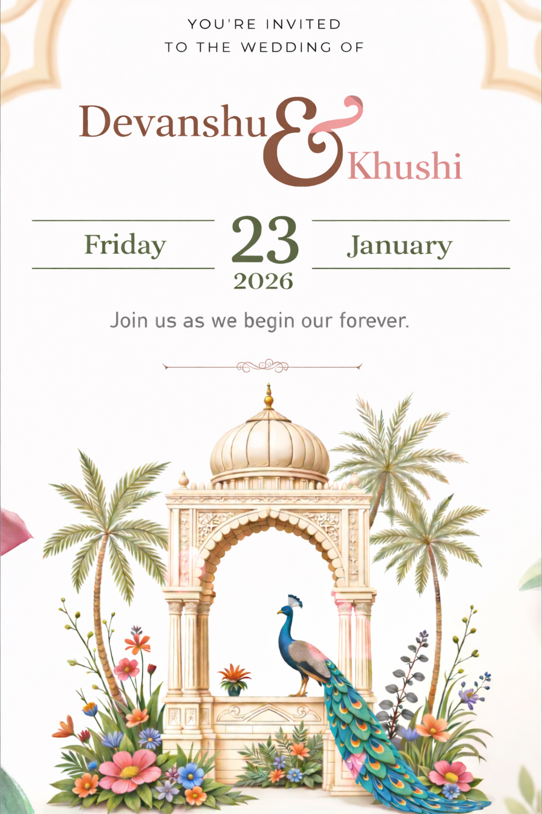

<p align="center"><a href="https://www.sarthakj.me/WeddingEvite/"></a></p>
<h1 align="center"><a href="https://DevanshuAyushi.netlify.app/assets/SI.pdf">Wedding Invitation</a> :ring: <br> <br> SAVE THE DATE: 23rd Jan, 2021 <br> <a href="https://DevanshuAyushi.netlify.app/">Website</a></h1>


## Wedding Invitation :ring:

<details>
  <summary><strong>View Invitation</strong></summary>
  <a href="https://DevanshuAyushi.netlify.app/"></a>
</details>

With the divine grace of the almighty, inviting you and your family to Devanshu's wedding to be held on **23rd January at [Milana Resort](https://g.page/Milan Resort Kota),  Jhalawar, Rajasthan from 3:00 PM** onwards.

- [Download](https://DevanshuAyushi.netlify.app/assets/SI.pdf) the Invitation card

- Find [venue](https://g.page/Milan Resort Kota) on Google map

- Visit the [website](https://DevanshuAyushi.netlify.app) for more details


```js

const newCouple = 'Devanshu & Ayushi';

// Feb 14, 2021
const weddingDate = new Date(2021, 02, 14);

// Wedding venue: https://g.page/Milan Resort Kota
const weddingVenue = new Location('Milan Resort, Rajasthan');

(function() {
    newCouple.willTieKnot(weddingDate);

    // your presence is requested
    (new Wedding()).acceptInvitation(
        window.open('https://DevanshuAyushi.netlify.app/')
    );
})();


```
## Are you or your loved ones a *bride-to-be* or *groom-to-be*? 
> Feel free to use this template to build your wedding website!

### Do not forget to leave a star! :hugs:

<br><sup><i>With warm regards,<br>
**Devanshu Gautam**<i></sup><br>

## Credits for the Project 

* Devanshu Gautam - GitHub - https://github.com/vinitshahdeo  Project - https://github.com/vinitshahdeo/Wedding-Invitation

 